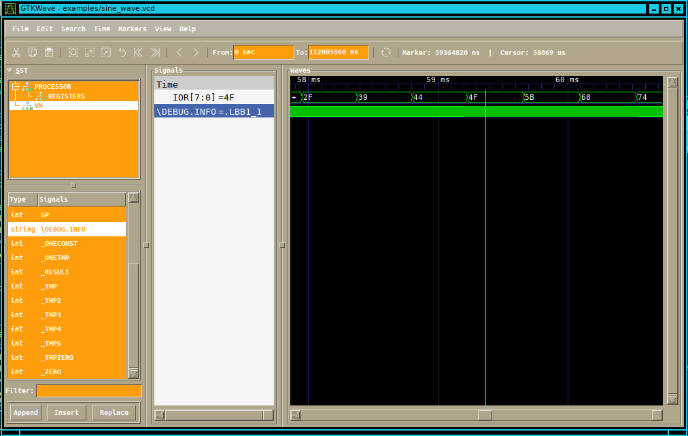

# mOISC-dRISC


Open source implementation of a multi-One Instruction Set Processor (mOISC) or dynamic Reduced Instruction Set Computer (dRISC) for microcontroller applications.

This repository comprises a basic monolithic compilation toolchain that compiles C source code to mOISC assembly and to binary files using the `clang` front-end LLVM-IR output. Moreover, it translates `clang` and `llc` generated assembly of commercial ISA (ARM, MIPS, RISC-V and x86) to the
mOISC assembler and binary files and provides an RTL proof-of-concept microarchitecture written in VHDL. mOISC can be used for educational purposes or other research activities, for instance for devising other minimalistic computer architectures.

Copyright (C) 2020-2021 Marco Crepaldi, Istituto Italiano di Tecnologia (www.iit.it), Electronic Design Laboratory (https://edl.iit.it).

The software is *experimental* and *work in progress*. We have not implemented all LLVM-IR instructions, and the compiler works for simple programs based on integer variables, vectors and pointers. The mOISC processor (picocontroller) is conceived for low complexity applications. This software is a starting point to devise more complex projects/architectures. This code is the output of an our internal research project involving OISC.

## CPU description

##### <strong>A full machine description (registers included) is available in the first commented lines of the file `m.py`</strong>.

## Prerequisites

The software has been tested under MacOS with the Darwin Kernel Version 20.5.0, and under CentOS Linux 7, with Kernel 3.10.0-1160.25.1.el7. We have tested compilation using LLVM 9.0 and 10.0. The RTL description has been verified using Quartus Prime Lite 19.1 and 20.1 in a realistic wireless telemetry application involving an SPI LoRA transceiver and an I2C temperature sensor.

To run the compilation and simulation toolchain you need to install the following software:

+ `python3` ([download](https://www.python.org/downloads/));
+ `python3` modules listed [here](./requirements.txt) - you may run `pip3 install -r ./requiremets.txt`. *NOTE*: creating a python *virtualenv* is adviced.
+ `llvm` and `clang` version >= 9.0 ([download](https://llvm.org));
+ `gtkwave` ([download](http://gtkwave.sourceforge.net)).

For the FPGA synthesis you need to install the following software:

+ Quartus Prime Lite ([download](https://fpgasoftware.intel.com/?edition=lite));

*Note: Using Quartus Prime is subject to the acceptance of the End User License Agreement. See section License for further details.*

## Compilation of C source code

Compilation from C to binary files is achieved using `mc.py` and `m.py`. For ease of use we have created two scritps that compile
the code by running both programs in sequence.

All the source files can be placed in the `examples/` folder.

Code can be compiled in OISC mode and in CISC mode. We refer here to a sample code that generates a frequency modulated sine wave on the IOR port, `sine_wave.c`. The mOISC include file required for compilation is in `lib/inc` and its corresponding C code is automatically included by `mc.py` at compilation time.

### Compilation to CISC mode

#### Code generation from LLVM-IR

To compile in CISC mode an example code `sine_wave.c` run the following command,
```
./compile-cisc examples/sine_wave ll
```
where `ll` stands for low-level and invokes compilation based on clang LLVM-IR output.
After compilation the following files will be generated: `sine_wave.fasm` (assembly in CISC mode), `sine_wave.uasm` (unlinked assembly in OISC mode),
`sine_wave.sym` (symbol file for simulation), `sine_wave.bin` (binary file for simulation), `sine_wave.mif` (MIF file for FPGA programming),
`sine_wave.ll` (LLVM-IR code generated by `clang` before low-level compilation).

#### Code translation from assembly

To generate mOISC assembly from known ISA architectures assembly, run the following command,
```
./compile-cisc examples/sine_wave arm
```
where `arm` identifies the ISA, in this example ARM. Supported ISA are `x86`, `riscv`, `arm`, `mipsel`.
After compilation the following files will be generated: `sine_wave.fasm` (assembly in CISC mode), `sine_wave.uasm` (unlinked assembly in OISC mode),
`sine_wave.sym` (symbol file for simulation), `sine_wave.bin` (binary file for simulation), `sine_wave.mif` (MIF file for FPGA programming),
`sine_wave.<arch>` (`<arch>` assembly generated by `clang` and `llc` before translation).

### Compilation to OISC mode

#### Code generation from LLVM-IR

To compile in OISC mode an example code `sine_wave.c` run the following command,
```
./compile examples/sine_wave ll
```
where `ll` stands for low-level and invokes compilation based on `clang` LLVM-IR output.
After compilation the following files will be generated: `sine_wave.asm` (assembly in OISC mode),
`sine_wave.sym` (symbol file for simulation), `sine_wave.bin` (binary file for simulation), `sine_wave.mif` (MIF file for FPGA programming),
`sine_wave.ll` (LLVM-IR code generated by `clang` before low-level compilation).

#### Code translation from assembly

To generate mOISC assembly from known ISA architectures assembly, run the following command,
```
./compile examples/sine_wave arm
```
where `arm` identifies the ISA, in this example ARM. Supported ISA are `x86`, `riscv`, `arm`, `mipsel`.
After compilation the following files will be generated: `sine_wave.asm` (assembly in OISC mode),
`sine_wave.sym` (symbol file for simulation), `sine_wave.bin` (binary file for simulation), `sine_wave.mif` (MIF file for FPGA programming),
`sine_wave.<ARCH>` (`<ARCH>` assembly generated by `clang` and `llc` before translation).

## Simulation of the compiled code

To run graphical simulation (internally invoking `gtkwave`), run the following command,
```
./simulate examples/sine_wave
```
The tool will open the files `sine_wave.bin` and `sine_wave.sym` that are obtained based on the previously
run compilation.

Let the system simulate for a while, then press CTRL-C to stop the simulation execution and visualyze the results (few seconds will be enough for `sine_wave`). The simulation engine will generate a VCD file that will be opened in the same `examples/` subdirectory, and used as input for `gtkwave`. Once opened, add IOR to the currently displayed wave to see the effect of the code on the I/O output port. You can also add `\DEBUG.INFO` for information on the currently executed function.

The `gtkwave` screen should look like this:



## Generation of synthesizable VHDL code

The toolchain also provides automatic VHDL and Quartus project files generation for a [Cyclone 10LP Evaluation Kit](https://www.intel.com/content/www/us/en/programmable/products/boards_and_kits/dev-kits/altera/cyclone-10-lp-evaluation-kit.html), with IOR port pin mapping configured by default as,

| FPGA Pin  | dRISC Pin |
|-----------|-----------|
| PIN_B1    | IOR[0]    |
| PIN_C2    | IOR[1]    |
| PIN_F3    | IOR[2]    |
| PIN_D1    | IOR[3]    |
| PIN_G2    | IOR[4]    |
| PIN_L14   | IOR[5]    |
| PIN_G1    | IOR[6]    |
| PIN_J2    | IOR[7]    |
| PIN_D9    | RST       |

The CLK pin is the default physical pin of the on-board 50MHz oscillator.

In all cases, pins can be configured using `mautogen.py` and by adding additional arguments to `autogen`. Run `python3 mautogen.py -help` for further information.

*Note: the pin configuration exemplified in the `mautogen.py` command line help works for the example `iotest.c`. This file tests the correct operation of the minimalistic mOISC interrupt strategy.*

To generate the processor VHDL code with preconfigured Quartus project files the toolchain utilizes `mautogen.py`. Run the following script:
```
./autogen examples/sine_wave
```
The script internally calls `mautogen.py` and generates a full Quartus project in a subfolder `quartusrtl.out`, including only the
needed instructions defined in the assembly code. Make sure the code is compiled in OISC mode. The generated processor
will be able to run both CISC and OISC mode code in any case, but `autogen` will process only OISC mode assembler files.

To generate a full featured processor (recommended) run:
```
./autogen examples/sine_wave -mkfull
```
This way, the tool will generate a full featured processor in a subfolder `quartusrtl.out.full`. In this case the OISC mode assembly is dummy but it is required for code generation.

For all descriptions, the synthesis tool is configured by default to optimize logic timing.

For both cases, the VHDL project will contain the MIF file for internal SRAM initialization including the compiled code.
To run other programs, it is just necessary to overwrite the file `fpga.mif` and re-generate the assembly file for the FPGA.

### Note on command line options

The mOISC toolchain is based on `m.py`, `mc.py` and `mautogen.py`, that are called in the scripts `compile`, `compile-cisc`, `simulate` and `autogen`.
All these programs refer to the subfolder `/lib` and all its files. Other compilation and simulation options are available.

For instance, run the command `python3 m.py --help` to print the options of `m.py`. The same applies for `mc.py` and `mautogen.py`.

## License

The files contained in this repository are licensed under the BSD-3-Clause license, except the following:

+ the files in /lib/autogen named dRISC.qsf, dRISC.qpf, dRISC_PLL.cmp, dRISC_PLL.vhd, iobuf.cmp, memory.cmp, memory.vhd,
  dRISC_chain.cdf, memory.qip, memory_inst.vhd, dRISC.qsf are generated by the Intel Quartus software, and are licensed under the terms and conditions
  described in the Intel Program License Subscription Agreement, the Intel Quartus Prime License Agreement, the Intel FPGA IP License Agreement, or other
  applicable license agreement, including, without limitation, that your use is for the sole purpose of programming logic devices manufactured by Intel
  and sold by Intel or its authorized distributors.

  More information at: https://fpgasoftware.intel.com/eula

+ the file dRISC.qsf contains additional *commented lines* written by Marco Crepaldi, Istituto Italiano di Tecnologia.

+ all the .c and .h files and the file pysensor.py in the subfolder examples/ are subject to Open Source
  Licensing GPL V3.

+ examples/RH_RF95.h, copyright (C) 2014 Mike McCauley (mikem@airspayce.com),
  with code commented on line 15 and from line 505 until the end of file by Marco Crepaldi, Istituto Italiano di Tecnologia.

For all the other files, we report the BDS-3-Clause license:

Copyright 2020-2021 Marco Crepaldi, Istituto Italiano di Tecnologia, Via Morego 30, 16163, Genova, Italy.

Redistribution and use in source and binary forms, with or without modification, are permitted provided that the following conditions are met:

+ 	Redistributions of source code must retain the above copyright notice, this list of conditions and the
	following disclaimer.

+ 	Redistributions in binary form must reproduce the above copyright notice, this list of conditions and the
	following disclaimer in the documentation and/or other materials provided with the distribution.

+ 	Neither the name of the copyright holder nor the names of its contributors may be used to endorse or
	promote products derived from this software without specific prior written permission.

THIS SOFTWARE IS PROVIDED BY THE COPYRIGHT HOLDERS AND CONTRIBUTORS "AS IS" AND ANY EXPRESS OR IMPLIED WARRANTIES, INCLUDING, BUT NOT LIMITED TO, THE IMPLIED WARRANTIES OF MERCHANTABILITY AND FITNESS FOR A PARTICULAR PURPOSE ARE DISCLAIMED. IN NO EVENT SHALL THE COPYRIGHT HOLDER OR CONTRIBUTORS BE LIABLE FOR ANY DIRECT, INDIRECT, INCIDENTAL, SPECIAL, EXEMPLARY, OR CONSEQUENTIAL DAMAGES (INCLUDING, BUT NOT LIMITED TO, PROCUREMENT OF SUBSTITUTE GOODS OR SERVICES; LOSS OF USE, DATA, OR PROFITS; OR BUSINESS INTERRUPTION) HOWEVER CAUSED AND ON ANY THEORY OF LIABILITY, WHETHER IN CONTRACT, STRICT LIABILITY, OR TORT (INCLUDING NEGLIGENCE OR OTHERWISE) ARISING IN ANY WAY OUT OF THE USE OF THIS SOFTWARE, EVEN IF ADVISED OF THE POSSIBILITY OF SUCH DAMAGE.
